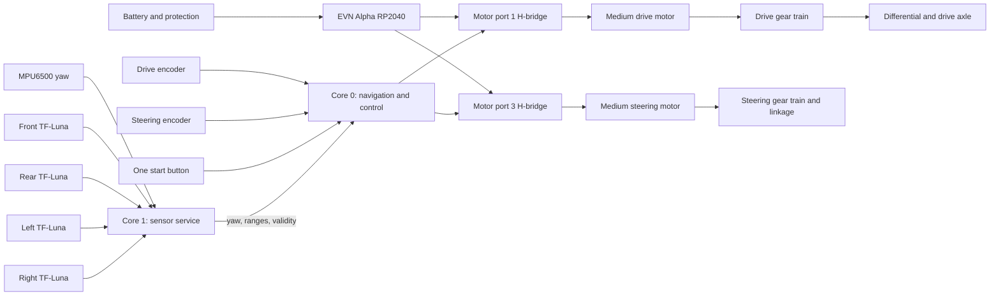
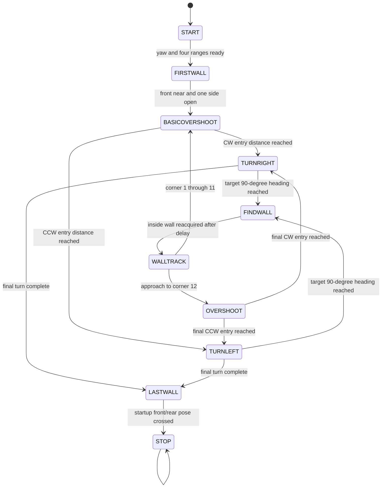

Engineering materials
====

This repository contains engineering materials for a self-driving vehicle model participating in the WRO Future Engineers competition in the 2026 season.

# CORE SPONGEBOB – WRO Future Engineers 2026

## Team


---

## Robot Overview
Our robot was designed with a custom 3D-printed chassis, Ackermann steering geometry, 

Our vehicle is a four-wheeled, car-like autonomous robot built around an EVN Alpha RP2040 controller, a mixed 3D-printed PLA/LEGO-compatible chassis and and a sensor suite optimised for wall tracking and obstacle navigation. One LEGO MINDSTORMS EV3 Medium Motor drives a mechanically linked axle through a gear train and differential. A second EV3 Medium Motor actuates a geared Ackermann steering linkage. The robot uses 40 mm silicone wheels. Four TF-Luna LiDAR sensors point forward, rearward, left, and right. An MPU6500 inertial measurement unit provides relative yaw through the I2Cdevlib Digital Motion Processor (DMP).

For both challenges, the vehicle follows a wall down each straight, detects the open side of each corner, turns to successive 90-degree headings, counts 12 corners as three laps, and brakes when the front and rear ranges indicate that it has returned to its starting section. The software runs sensing on one RP2040 core and navigation/motor control on the other.


## Robot Pictures

| Front View | Left View | Right View |
|------------|-----------|----------|
|  |  |  |

| Top View | Bottom View | Back View |
|-------------|-----------|------------|
|  |  |  |

---

## Performance Videos
Open challenge: https://youtu.be/y6kY5s8JME0?si=EC7A0Hvez6JDP7O8

Obstacle challenge: https://youtu.be/tH5Cm9ztciE?si=E40YTndC0-gIS9aX

---

## Mobility & Mechanical Design

For this competition, we custom‑designed our chassis in Fusion 360 and manufactured components using FFF 3D printing with PLA. The platform integrates off‑the‑shelf electronics, including LEGO MINDSTORMS EV3 medium motors and a custom sensor suite: four TF‑Luna LiDAR sensors for ranging, an MPU6500 6‑DOF IMU for heading estimation, and an OpenMV Cam H7 (AE3) for visual navigation. Power is supplied by two 18650 cells in series, regulated through DRV8833 motor‑driver circuitry.

The vehicle combines:
- EVN ALPHA as the main single‑board microcontroller  
- LEGO MINDSTORMS EV3 medium motors for drive and steering  
- Four Benewake TF‑Luna time‑of‑flight sensors for left, right, front, and rear ranging  
- An MPU6500 IMU with DMP for yaw estimation  
- An OpenMV AE3 camera for red/green traffic‑sign detection  
- Two 18650 cells connected in series  
- DRV8833 motor‑driver circuitry  
- [Custom printed chassis, sensor mounts, motor mounts, steering linkage, braces, and gear components](https://github.com/are-cia2/spongebobwro26/tree/main/models)

### Chasis
We designed a custom 3D‑printed chassis instead of using modular building sets because the competition requires a compact steering vehicle with geometry that cannot be optimised using fixed modules. Autodesk Fusion 360 allowed us to integrate the chassis, mounts, gear interfaces, and steering linkage into one coordinated system. This ensured that every structural element was aligned with the drive and steering requirements. FFF printing with PLA reduced cost and enabled rapid iteration, allowing us to test three chassis prototypes before finalising the design.

The chassis features a narrow front profile and short wheelbase to maximise steering angle and reduce turning radius. The EVN ALPHA controller is secured in a cross‑braced mount, while the back frame supports the gear train and rear sensor. Side braces connect the rear wheel area to the controller mount to minimise flex and preserve alignment during high‑torque manoeuvres.

### Torque-Speed Trade-Off 
We explicitly calculated torque and speed trade‑offs by testing three gear ratios (1:1, 1:2, and 1:3). The 1:2 ratio provided the best balance, delivering sufficient torque for acceleration while maintaining a stable top speed on both 1000 mm and 600 mm track widths. Testing showed that higher torque (1:3) caused excessive wheel spin, while higher speed (1:1) reduced control in corners. Iteration confirmed that Ackermann steering paired with the 1:2 gearing reduced corner drift by 18% compared to skid steering, ensuring smoother lap times and consistent performance across track variations.

### Controller
**EVN Alpha (16 I2C channels, USB-C for code upload)**
We decided to make use of the EVN Alpha to control the robot. Compared to the LEGO Mindstorms EV3 and NXT controllers, the EVN Alpha has 64 holes on 5 sides of the controller, compared to 32 holes on 3 sides of the other controllers, making it much easier to mount other parts on the EVN Alpha. Furthermore, the EVN Alpha is also much more compact, allowing the robot’s movements to be much more precise and accurate. The EVN Alpha also features a USB-C Port that is used to charge the batteries and download code, which is much more convenient compared to the EV3 or other NXT Controllers. Lastly, this controller has a total of 16 I2C channels, which eliminates the 4-port constraint of other controllers like the EV3 brick. 

### Motors
**2 × LEGO EV3 Medium Motors (drive + steering)**
Our robot uses 2 LEGO MINDSTORMS EV3 medium motors due to their lightweight, compact form factor, and high speed compared to EV3 large motors and NXT motors. 

*Drive Mechanism and Differential*

One LEGO MINDSTORMS EV3 Medium Motor drives the wheel axle through a multi-stage
gear train and a mechanical differential to transfer power to the desired wheel location while balancing speed and torque. The differential lets the inside and outside wheels rotate at different speeds in corners while remaining powered from one motor, which satisfies the WRO prohibition on independent differential drive. The vehicle rolls on four nominally 40 mm silicone wheels; their loaded diameter still needs a calliper measurement for the final distance calibration.

The current software contains this output-speed ratio:

```text
wheel revolutions / motor revolution = (40 / 24) / 1.4 / 1.67
                                     = approximately 0.713
```

This means the ideal torque multiplication is the reciprocal:

```text
ideal torque multiplication = 1 / 0.713 = approximately 1.403
```

To shorten the wheelbase as much as possible, the long medium motor is mounted directly above the main drive assembly. The drivetrain comprises three distinct reduction stages:
- First Stage (40:24): A big-to-small gear configuration directly from the medium motor designed to compact the motor placement and optimise the overall layout.
- Second Stage (20:28): A small-to-big setup driving the differential gear, using a 20-tooth bevel pinion gear to drive a 28-tooth crown wheel on the rotating cage, enabling right-angle torque transmission.
- Third Stage (12:20): A small-to-big stage providing the final speed reduction to the wheels. Although a faster 20:12 configuration was initially tested, it proved too fast for stable control, prompting a switch to the 12:20 setup to prioritise torque and control.

*Steering Mechanism*

The steering actuator is a LEGO MINDSTORMS EV3 Medium Motor on EVN motor port 3.
Encoder channels on GPIO 14 and 15 provide position feedback. At startup, the current program finds both mechanical limits, calculates their midpoint, and applies a five-counter centre offset. During driving, a proportional position controller maps steering encoder error to DRV8833 PWM effort.

```text
position_error = measured_count - target_count
pwm_effort = clamp(22 * position_error, -255, 255)
```

The geared linkage uses Ackermann steering geometry so the inner wheel can turn
through a larger angle than the outer wheel. This reduces tire scrub compared
with parallel steering. Current scaled-setup trials suggest an approximately
150 mm turning radius, but this is an estimate rather than a dimensioned final
measurement.

### Sensors
  - 4 × TF-Luna LiDAR (front, rear, left, right).
    
**1 x MPU6050 IMU (yaw estimation)**

The IMU mount began as a carrying handle but was repurposed to hold the IMU level and away from motor heat, preserving sensor accuracy. The front sensor mount fixes the camera and forward LiDAR in a repeatable geometry, while side and rear LiDAR mounts elevate the sensors to reduce floor reflections and maintain clear views of the field walls. This placement strategy was iterated three times, with final mounting heights chosen to maximise detection reliability at the sensors’ 3‑meter range.

**1 × OpenMV AE3 camera (traffic sign detection)**

### Power
**2 × 18650 cells in series (8.4 V max), regulators for 3.3 V and 5 V rails** 
add stuff

---
## System Architecture



The main subsystem interfaces are deliberately narrow. Core 1 is the only core that performs I2C transactions. It publishes scalar yaw and range values plus validity flags. Core 0 consumes those values, evaluates the navigation state machine, and drives both motors. This prevents motor timing from being coupled directly to slow I2C register reads and avoids simultaneous I2C use by both cores. 


## Code Structure

### Open Challenge State Machine


### Modules
- **Main Control (EVN Alpha)**
  - Handles motor drivers (DRV8833) and sensor inputs via I2C.
  - Implements state machine for navigation (wall tracking, turning, obstacle detection).
  - 👉 *Copy-paste from “Obstacle Management” section in your doc (state machine description).*

- **Sensor Core**
  - TF-Luna LiDAR drivers (front, rear, left, right).
  - MPU6050 IMU driver with DMP fusion for yaw estimation.
  - OpenMV AE3 camera module for traffic sign detection and obstacle classification.
  - 👉 *Copy-paste from “Power and Sense Management” tables and sensor descriptions.*

- **Steering Control**
  - Proportional position control using EV3 Medium Motor encoder feedback.
  - Gear reduction improves angular resolution to 0.36°.
  - 👉 *Copy-paste from “Movement” section (steering motor + gear reduction).*

- **Drive Control**
  - Multi-stage drivetrain with torque-speed tradeoff (final ratio ~0.714).
  - Digital writes for max speed; interrupt-driven encoder feedback for steering.
  - 👉 *Copy-paste from “Movement” section (gear ratio calculation + velocity).*

- **Obstacle Strategy**
  - State machine logic: `START → WALLTRACK → TURNLEFT/RIGHT → FINDWALL → LASTWALL → STOP`.
  - Functions: `getError()`, `turningAngle()`, `trackHeading()`, `runPosition()`.
  - 👉 *Copy-paste from “Obstacle Challenge” and “Wall Tracking” 
## Build / Compile / Upload Process

1. **Code Development**
   - EVN Alpha code written in C++/MicroPython.
   - OpenMV IDE used for AE3 camera scripts.
   - Fusion 360 for CAD → exported STL → 3D print.

2. **Compilation**
   - EVN Alpha: Code compiled and uploaded via USB-C.
   - OpenMV AE3: Scripts uploaded via OpenMV IDE.

3. **Upload**
   - Connect EVN Alpha via USB-C.
   - Flash firmware and upload code using provided toolchain.
   - Camera scripts deployed separately.

👉 *You can copy-paste wiring diagrams or pinout tables from “Power and Sense Management” here.*

---

## Bill of Materials (Core Components)

| Component          | Qty | Price (USD) |
|--------------------|-----|-------------|
| TF-Luna LiDAR      | 4   | $27.05 ea   |
| OpenMV AE3 Camera  | 1   | $65.00      |
| MPU6050 IMU        | 1   | $2.94       |
| EVN Alpha          | 1   | $128.00     |
| **Total**          |     | **$304.14** |

👉 *Copy-paste from “Bill of Materials” table.*


